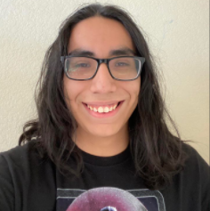

# Alex Hernandez Perez's Page 
[Who am i](##Who-am-I-?)
[Who am i as programmer?](##Who-am-I-as-a-programmer-?)



> "oh wow. oh wow. oh wow." 
> Steve Jobs

## Who am I ? 
Like the first heading My name is Alex. Im a 3rd year transfer student at UCSD hoping to graduate in the spring of 2023. I wouldnt say Im out going but I dont 
mind talking to people if they approached me. 

Some of my hobbies include
- listening to music
- playing video games
- reading manga/watch anime
- practicing karate 
- very rarely editing videos/photos

Things I hope to achieve this quarter :
- [ ] Make some more friends 
- [ ] strengthen my programming skills 
- [ ] Maintain GPA Above 3.0 **hopefully**
  

## Who am I as a programmer?
I am a solid programmer, even though I'm a Transfer, I started from the very beginning of the UCSD's programming courses. Very glad to have taken those 
those early classes because I have built all my skills I know today and I am proud how far I have come as a programmer. I always enjoy when writing something 
and have the ~~oh I am idiot~~ big brain moment and solve a bug I working through. Learning new languages is very fun. Over the past years these are the languages I 
have picked from strongest to top of the list to weakest at the bottom. 
1. C++ 
2. Python
3. *Does **SQL** count as language?*
4. Java
5. html/css 
6. javascript/php

Link to my [GitHub Profile](https://github.com/anh010)

[Read me file](README.md)

This is a python snippet I used to query a database 

```
def getParentTask(id):
    db = mysql.connect(host=HOST,database=DATABASE,user=USER,password=PASSWORD,port=PORT)
    print("connected to: ",db.get_server_info())
    cursor=db.cursor()
    query = "SELECT task,reward from parentTask where petid='"+id+"';"
    cursor.execute(query)
    record = cursor.fetchall()
    if record is None:
            print("no custom task assigned yet")
            return None
    db.close()
    return(record[0][0],record[0][1])
    
```

Thank you for checking out my page. 
